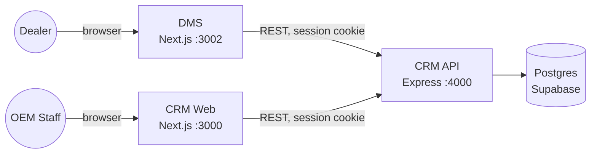
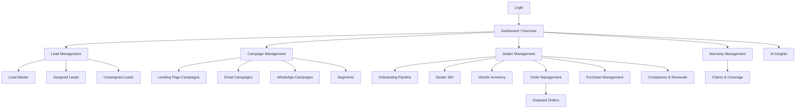
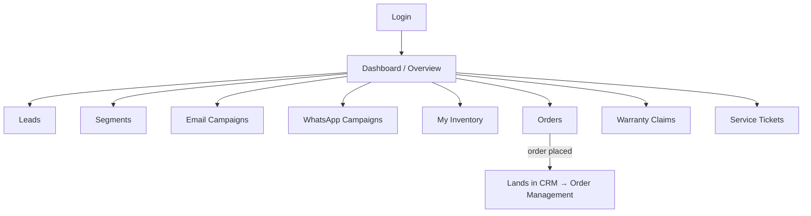
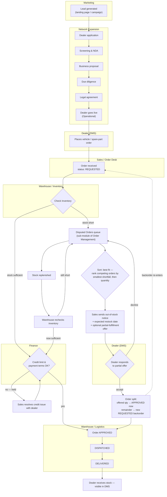

# Architecture & User Flows — Luxus Green Mobility

## 1. System Architecture

- DMS has no database of its own — every read/write goes through the CRM API, same DB as the CRM web app.
- One dealer action in DMS is visible in the CRM instantly (same rows), and vice versa.

## 2. Complete Website User Flow

### CRM (OEM staff side)

### DMS (dealer side)

## 3. Dealer Onboarding → DMS → CRM Order Flow (with department handoffs)

Each box's swimlane is the OEM department/role responsible for that step.

## 4. Department Collaboration Plan (RBAC)

| Department | Role | Owns in order lifecycle | System module |
|---|---|---|---|
| Sales / Order Desk | `SALES`, `RELATIONSHIP_MANAGER` *(existing)* | Receives order, dealer communication, sends notices | Order Management, Dealer 360 |
| Warehouse / Inventory | `WAREHOUSE` *(new)* | Check Inventory, stock allocation, Disputed Orders queue | Vehicle Inventory, Order Management |
| Finance | `FINANCE` *(new)* | Dealer credit-limit / payment-terms gate before dispatch | Finance Cases, Dealer 360 |
| Warehouse / Logistics | `WAREHOUSE` or `LOGISTICS` *(new)* | Dispatch → Delivered, shipment tracking | Order Management |
| Marketing | `MARKETING` *(new)* | Lead-gen & campaigns — upstream of orders only | Campaign Management |
| Admin / System Admin | `ADMIN`, `SYSTEM_ADMIN` *(existing)* | Oversight across all departments | All modules |

**Status:** `WAREHOUSE`, `FINANCE`, `MARKETING` now exist on `UserRole` and are wired **additively** into the routes in their row (Order Management + Check Inventory + Disputed Orders + Spare Part Inventory accept `WAREHOUSE`, Finance Cases accepts `FINANCE`, Campaign Management accepts `MARKETING` — always alongside `ADMIN`/`SYSTEM_ADMIN`, never instead of).
**Known gap:** `requireAuth` is still a dev-only stub (`apps/api/src/middleware/auth.middleware.ts`) that defaults every request to `SYSTEM_ADMIN` regardless of who's logged in — so today these roles don't yet *restrict* anyone in practice. Real enforcement needs `requireAuth` to resolve the logged-in user's actual role from their session, not the stub default — that's the next step, not a UI change.

## 5. Disputed Orders — Best Fit & Partial Fulfillment

- **Sort: best fit** groups disputed orders competing for the same item (model+segment, or same spare part) and ranks them by ascending shortfall against *live* stock, tied-broken by largest quantity — the order closest to being fully fulfillable from what's on hand is flagged "Best fit."
- Staff can send a notice with an **offered quantity** (e.g. "155 of 160 now"). The dealer sees this in DMS and can **Accept** (splits the order — offered quantity ships now as `APPROVED`, the remainder becomes a fresh `REQUESTED` backorder, `STR-2026-0000xx`, so demand is never silently lost) or **Decline** (order stays in Disputed Orders).
