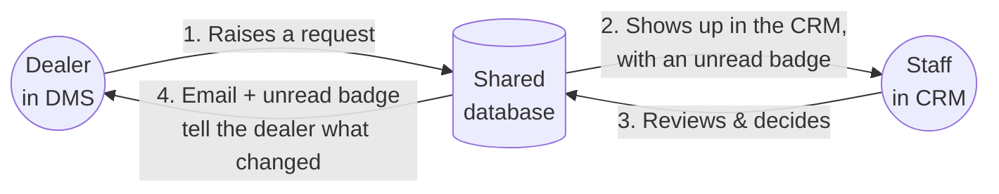
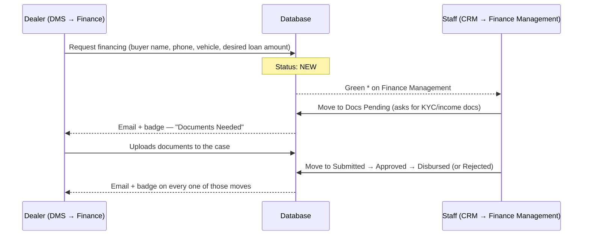
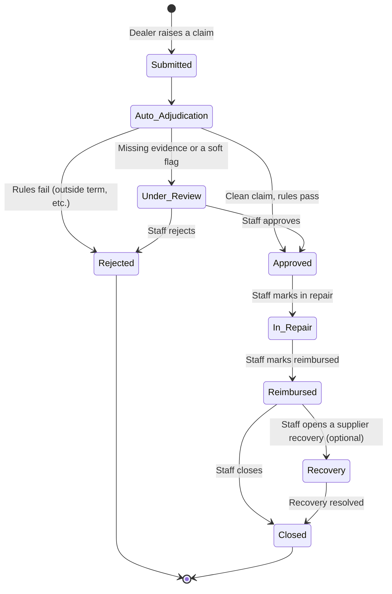
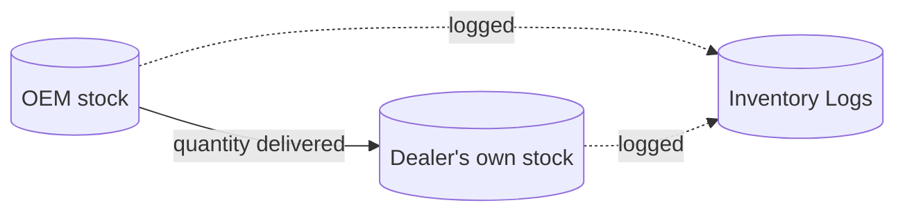
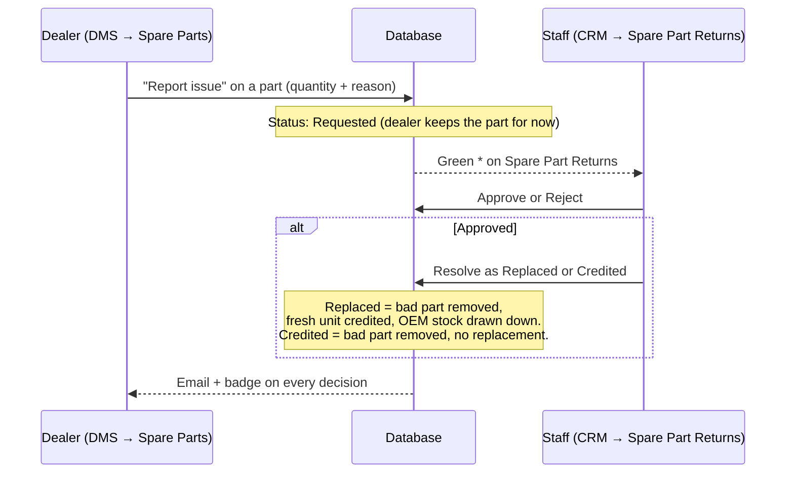

# Closed-Loop Modules — Finance, Warranty & Inventory

How **Finance Management**, **Warranty Management**, and **Inventory Management** (specifically its Spare Part Returns loop) work, and how to operate each one — for dealers in **DMS** and staff in the **CRM**.

## The idea behind "closed loop"

DMS and the CRM exist to solve one problem: getting a manufacturer and a dealer talking to each other without phone calls and spreadsheets. **Order Management** is the module that already does this well, and it's the template every module below copies:

Four pieces, every time:

1. **A dealer raises something in DMS** — an order, a finance request, a warranty claim, a quality complaint.
2. **It shows up in the CRM** with a small green **\*** or a red count badge in the sidebar, so staff know something needs attention without hunting for it.
3. **Staff make a decision** — approve, reject, dispatch, resolve, whatever the module calls it.
4. **The dealer finds out two ways**: an email lands in their inbox, and a badge lights up in DMS next time they're in the app. Nobody has to go re-check a page "just in case."

If a status change also moves physical stock (a delivery, a warranty part replacement, a returned part), it's logged permanently in **Inventory Logs** — one place to see every unit that ever moved between the manufacturer and a dealer, and why.

The rest of this document covers each module's own version of that loop.

---

## 1. Finance Management

**What it's for:** a dealer's customer wants a loan to buy a vehicle. The dealer requests financing; the manufacturer's finance desk works it through to a bank/NBFC and tells the dealer when it's approved and money has moved.

### How it works

### Status pipeline

| Status | Meaning | Who sets it |
|---|---|---|
| **New** | Just requested, nobody's looked at it yet | Dealer (automatic on request) |
| **Docs Pending** | Finance desk needs KYC/income documents before proceeding | Staff |
| **Submitted** | Sent to the bank/NBFC | Staff |
| **Approved** | Financier approved the loan | Staff |
| **Disbursed** | Money has moved — safe to deliver the vehicle | Staff |
| **Rejected** | Financier declined | Staff |

### How to operate it

**As a dealer (DMS → Finance Management):**
1. Click **Request financing**.
2. Fill in the buyer's name and phone (required), vehicle model and desired loan amount (optional — the finance desk fills in the real financier/approved amount once they've worked the case).
3. Submit. You'll see it in your list immediately at status **New**.
4. If it moves to **Docs Pending**, open the request and upload the buyer's documents — there's an upload box right there with a banner telling you what's needed.
5. Watch the status badge and your email for every update — no need to keep refreshing.

**As staff (CRM → Finance Management):**
1. The sidebar's green **\*** tells you there's a new, unworked case.
2. Open the case, review the buyer/vehicle details and any documents the dealer uploaded (visible in the same edit panel).
3. Update the **Status** dropdown as the case actually moves — Docs Pending, Submitted, Approved, Disbursed, or Rejected — and fill in Financier / Loan Amount once you know them.
4. Save. The dealer gets an email and their badge lights up automatically — you don't send anything separately.

---

## 2. Warranty Management

**What it's for:** a customer's vehicle has a problem covered by warranty. A claim gets auto-checked against the actual policy the moment it's submitted, and — for anything that isn't a clean-cut case — a human takes it the rest of the way through repair, reimbursement, and (if a supplier's part was at fault) recovering the cost from that supplier.

### How it works

The moment a claim is submitted, the **adjudication engine** checks it against the vehicle's actual warranty policy — no human involved yet:

| It checks | Against | Result if it fails |
|---|---|---|
| Time since registration | Plan's term (months) | **Rejected** — outside time term |
| Odometer reading | Plan's term (km) | **Rejected** — outside distance term |
| Measured battery health % | Plan's SoH floor (battery claims only) | **Rejected** if SoH is still above the floor |
| Charger type used | Plan's approved-charger list | **Rejected** if not an approved charger |
| Service records complete | Yes/no | **Rejected** if incomplete |
| Duplicate open claim on the same part | — | Flagged for review, not auto-rejected |

- **Every check passes** → auto-**Approved**, no human needed.
- **Any hard rule fails** → auto-**Rejected**.
- **Evidence is missing** (no odometer reading, no charger type, etc.) → **Under Review**, waiting on a person.

This is exactly why the intake form asks for odometer reading, battery health %, charger type, and a service-records checkbox — skip those and a claim that could have auto-approved instead sits in the review queue for no reason.

### How to operate it

**As a dealer (DMS → Warranty Management):**
1. Enter the vehicle's VIN and click **Check coverage** — it shows every covered component and whether it's currently in warranty.
2. Pick the affected component, fill in the customer's name and the issue.
3. Fill in **all** the evidence fields that apply — odometer, measured SoH % (battery issues), charger type (charger issues), and confirm service records are complete. This is what lets a clean claim auto-approve instead of waiting on a person.
4. Submit — you'll see the auto-adjudication result immediately.
5. From then on, watch the claim's status badge and your email. Click **Details** on any claim to see the full timeline (every decision, in order), the approved amount or rejection reason, and to attach evidence photos.

**As staff (CRM → Warranty Management → Claims & Coverage):**
1. The sidebar's green **\*** flags claims sitting at **Under Review** — the ones that genuinely need a decision.
2. Open a claim, review the adjudication notes and evidence, then **Approve** (with an amount) or **Reject** (with a reason).
3. As the physical repair happens, walk it forward: **Mark in repair → Mark reimbursed → Mark closed**.
4. If a supplier's part was actually at fault, open a **Supplier Recovery** case from the claim (the "Supplier Recovery" tab tracks it to Recovered or Written Off) — this is the manufacturer's own internal accounting, dealers don't see it.
5. Every one of your status changes emails the dealer automatically.

---

## 3. Inventory Management — two loops

Inventory Management closes two different loops: **stock actually moving on delivery** (automatic, nothing to operate) and **a dealer reporting a defective part** (the Spare Part Returns queue).

### 3a. Delivery reconciliation (automatic)

When Order Management marks a vehicle or spare-part order **Delivered**, stock moves for real — this isn't a status label, it's the actual inventory:

- The dealer's own inventory goes up by the delivered quantity; the manufacturer's stock goes down by the same amount — you never have to update both sides by hand.
- A green banner appears right there in **Order Management** the moment you mark something delivered, showing exactly what moved.
- Every movement is written permanently to **Inventory Management → Inventory Logs** — filterable by vehicle/spare part, by dealer, by direction (added/removed). This is the one place to answer "where did this stock go" months later.

Nothing to operate here beyond marking an order Delivered as usual — the reconciliation and the log entry happen for you.

### 3b. Spare Part Returns (quality issues)

**What it's for:** a spare part a dealer already has in stock turns out to be defective. Rather than it just sitting there, the dealer flags it and the manufacturer decides what happens to it.

| Status | Meaning |
|---|---|
| **Requested** | Dealer flagged it; nothing has physically moved yet |
| **Approved** | Staff agree it's a genuine quality issue |
| **Rejected** | Staff don't accept the return — nothing changes |
| **Resolved** | The actual event — see resolution below |

| Resolution (only at Resolved) | What happens to stock |
|---|---|
| **Replaced** | Bad quantity leaves the dealer's stock; a fresh good unit is credited straight back to them; the manufacturer's own stock is drawn down for the replacement |
| **Credited** | Bad quantity leaves the dealer's stock; settled as a financial credit, no replacement unit sent |

### How to operate it

**As a dealer (DMS → Inventory → Spare Parts):**
1. Find the part on your spare-parts table and click **Report issue**.
2. Enter how many units are affected and why.
3. Submit — it appears in the **Quality Returns** section below the main table at status **Requested**.
4. Click **Details** on any return to add photos of the defect, read staff's notes, or see the resolution once it's set.

**As staff (CRM → Inventory Management → Spare Part Returns):**
1. The sidebar's green **\*** flags new, unworked requests.
2. Click **Review**, check the dealer's reason and any photos they attached, then **Approve** or **Reject**.
3. Once approved, choose how to **Resolve** it — Replaced or Credited — and hit Resolve. That's the moment stock actually moves; it's logged to Inventory Logs automatically.
4. The dealer is emailed at every step.

---

## Where everything lives

| Module | DMS route | CRM route |
|---|---|---|
| Finance Management | `/finance` | `/finance-management` |
| Warranty Management | `/warranty` | `/warranty` |
| Spare Part Returns | Inside `/inventory/spare-parts` | `/inventory-management/returns` |
| Inventory Logs (the audit trail) | — (staff-only) | `/inventory-management/logs` |

## The notification mechanics, in one place

Every module reuses the exact same two signals, so once you know how one works you know them all:

- **Unread badge** — a small green **\*** (something new/unworked exists) or a red count (N things you haven't looked at) next to the module's name in the sidebar. It clears itself the moment you open that module — no "mark as read" button anywhere.
- **Email** — sent automatically the moment staff change a status. If a dealer's email address isn't on file, or the outgoing-email service isn't configured, the update still happens — the dealer just won't get the email, the in-app badge still works.
