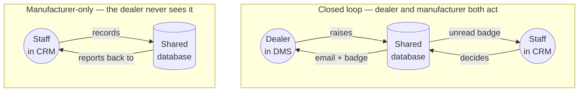
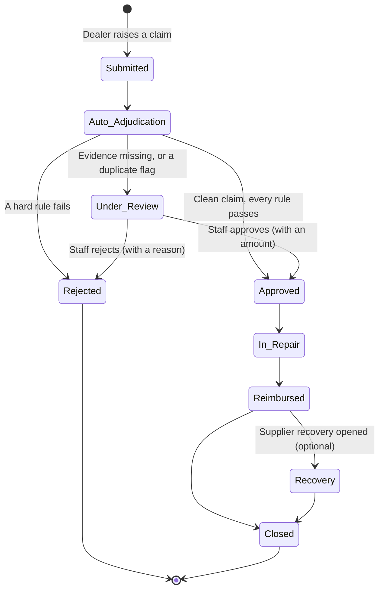
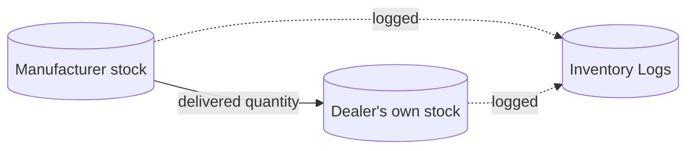
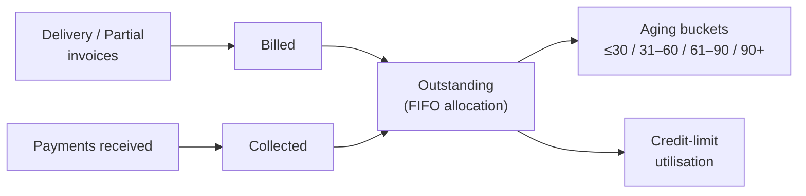
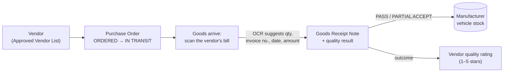

# Module Operations Guide — Warranty, Inventory, Finance & Purchase

How the four modules that were most recently reworked actually behave, and how to operate each one. Two of them (**Warranty**, **Inventory**) are dealer↔manufacturer *closed loops*; two of them (**Finance**, **Purchase**) are manufacturer-internal and deliberately have no dealer-facing side at all.

## The two shapes in this system

Not every module is a loop, and knowing which is which is most of understanding the app.

**Closed-loop modules** — Order Management, Warranty Management, and Inventory's delivery reconciliation. A dealer starts something in DMS, staff act on it in the CRM, and the outcome travels back to the dealer as an email *and* an unread badge. Nobody has to keep re-checking a page.

**Manufacturer-internal modules** — Finance Management and Purchase Management. These are the OEM's own books and own buying. A dealer has no login, no page, and no notification for either, and that's correct: how the factory pays its vendors and how it chases its own receivables is not the dealer's business.

---

## 1. Warranty Management — closed loop

**What it's for:** a customer's vehicle has a covered fault. The claim is auto-checked against the real policy the instant it's submitted; anything that isn't clear-cut goes to a human, who takes it through repair, reimbursement, and (if a supplier's part was at fault) recovering the cost from that supplier.

### Lifecycle

### What the auto-adjudication actually checks

| Check | Against | Fails if |
|---|---|---|
| Time since registration | Plan term (months) | Outside the term |
| Odometer reading | Plan term (km) | Over the limit |
| Measured battery health % | Plan SoH floor (battery claims) | SoH still above the floor |
| Charger used | Plan's approved-charger list | Not an approved charger |
| Service records complete | Yes / no | Incomplete |
| Duplicate open claim on the same part | — | Flagged for review, not auto-rejected |

Every rule passes → **auto-approved**. Any hard rule fails → **auto-rejected**. Evidence missing → **Under Review**, waiting on a person.

That last row is why the DMS intake form asks for odometer, battery SoH %, charger type, and the service-records checkbox. Leave them blank and a claim that could have settled itself instead queues up for manual review.

### How to operate it

**Dealer — DMS → Warranty Management**
1. Enter the VIN, click **Check coverage** — every covered component and whether it's still in warranty.
2. Pick the affected component, fill in the customer and the issue.
3. Fill in every evidence field that applies. This is what lets a clean claim auto-approve.
4. Submit — the adjudication result appears immediately.
5. Click **Details** on any claim afterwards for the full timeline, the approved amount or rejection reason, supplier-recovery status, and to attach photos.

**Staff — CRM → Warranty Management → Claims & Coverage**
1. The green **\*** in the sidebar flags claims at **Under Review** — the ones needing a decision.
2. Open one, read the adjudication notes and evidence, then **Approve** (with an amount) or **Reject** (with a reason).
3. Walk it forward as the repair happens: **Mark in repair → Mark reimbursed → Mark closed**.
4. If a supplier's part was at fault, open a **Supplier Recovery** from the claim; the Supplier Recovery tab tracks it to Recovered or Written Off.
5. Every status change emails the dealer automatically.

---

## 2. Inventory Management — closed loop (delivery) + audit trail

### Delivery reconciliation — automatic

When Order Management marks an order **Delivered**, stock moves for real:

- The dealer's inventory goes up, the manufacturer's goes down, by the same amount — nobody updates two places by hand.
- A green banner appears in Order Management showing exactly what moved.
- Every movement is written permanently to **Inventory Logs**, filterable by vehicle/spare part, dealer, and direction. This is where "where did this stock go" gets answered months later.

Nothing to operate — mark the order Delivered as usual and the rest happens.

### The three Inventory screens (CRM)

| Screen | What it shows |
|---|---|
| **Vehicle Inventory** | Every VIN, manufacturer stock gallery, stock-transfer requests |
| **Spare Parts Inventory** | The manufacturer's spare-part catalogue and quantities on hand |
| **Inventory Logs** | The append-only audit trail of every movement, and what caused it |

Dealers see their own side of this in DMS under **Inventory → My Inventory / Spare Parts**, including adding stock manually or by scanning a purchase bill (OCR).

---

## 3. Finance Management — manufacturer-only

**What it's for:** the money side of the dealer network. What each dealer has been billed, what they've paid, what's still open against their credit limit, and how old that balance is.

> **Why there is no dealer-facing side.** Retail financing — a walk-in customer taking a loan to buy a scooter — is the dealer's own business with their own bank. It isn't something the manufacturer's ERP tracks. What an OEM's finance function actually owns is the **receivable**: goods went out, money has to come back. That's what this module is.

### The two rules the module rests on

1. **A dealer owes money when goods reach them.** Order Management issues several documents per order — Confirmation when stock is reserved, Dispatch when it leaves, Delivery when it lands. Only **Delivery** and **Partial** are real liabilities; counting all of them would bill the same order three times.
2. **Outstanding and aging are computed, never stored.** Payments are allocated against invoices **oldest-first (FIFO)**, which is what a real ledger does with an unallocated "on account" receipt. The numbers can't drift away from the underlying invoices and payments, because they're re-derived every time you load the page.

### How to operate it

**Staff — CRM → Finance Management**
1. The top row gives the headline: **Billed to date**, **Collected**, **Outstanding**, and **Overdue (30+ days)**.
2. The **aging bar** below it splits the open money by age — this is what a collections desk actually works from. Chasing ₹5 lakh that's 90 days old matters more than ₹20 lakh billed last week.
3. The dealer table lists every dealer, biggest debtor first, with billed / collected / outstanding, a credit-limit utilisation bar (amber past 80%, red over limit), and the age of their oldest open invoice. Tick **Only dealers with a balance** to hide the settled ones.
4. **Click any dealer row** to open their ledger — every billable invoice with how much of it is still open and how old it is, plus the full payment history.
5. **Record payment** (from the header, or per-row): pick the dealer, enter the amount, mode (bank transfer / cheque / UPI / cash / adjustment), reference number, and date.
   - Leave **Against invoice** as *"On account"* in the normal case — it settles the oldest open invoices first.
   - Only tag a specific invoice when the dealer genuinely paid that one document.
   - An **Adjustment** is how you book a credit note or write-off without pretending cash moved.
6. A mis-keyed receipt can be deleted from the ledger's Payments tab — because everything is derived, removing the row corrects every number downstream instantly.

---

## 4. Purchase Management — manufacturer-only, with bill scanning

**What it's for:** the OEM's own buying. Vendors, purchase orders raised against them, goods received against those orders with a quality gate, and payments out.

This is the mirror image of Order Management: there, dealers buy from the manufacturer; here, the manufacturer buys from vendors.

### Bill scanning at goods receipt

Receiving goods is the data-entry-heaviest step in the module, so it's the one with OCR. When stock physically arrives:

1. Choose **Scan vendor bill** and upload a photo of the delivery challan or invoice (or **Enter manually** to skip).
2. The scan runs through the same OCR pipeline the dealer portal uses and comes back with suggestions: the **received quantity** (summed from the bill's line items), the **vendor invoice number**, **date**, and **amount**.
3. Everything lands in the form pre-filled and **fully editable**, with the scanned image and the extracted text shown side by side so you can check the numbers against the paper. A banner reminds you that these are suggestions, not gospel.
4. Confirm the quantity, set the **quality result** (Pass / Partial accept / Reject, with a reason when rejecting), add notes, and save.

The scanned bill stays attached to that receipt permanently, so the paper trail is in the system rather than a filing cabinet.

> PDFs upload and attach fine but can't be pre-filled from — the OCR engine reads images, not PDFs. Photograph the bill rather than scanning it to a PDF if you want the pre-fill.

### What happens when you save a receipt

- A **Goods Receipt Note** is created with its own GRN number.
- For a **Pass** or **Partial accept**, the accepted units become real vehicle stock — actual VIN rows, not a counter.
- The PO moves to **Partially received** or **Received** based on cumulative quantity.
- The vendor's **quality rating** moves: Pass +1, Partial accept −1, Reject −2, clamped to 1–5 stars.
- Receiving more than was ordered is now rejected outright — the server tells you exactly how many are still outstanding on that order.

### How to operate it

**Staff — CRM → Dealer Management → Purchase Management**
1. **Add a vendor first** — a PO can't be raised without one. Blacklisted vendors are blocked from new POs.
2. **New purchase order** — pick the vendor, model, segment, quantity, unit cost, and the expected date.
3. **Click any PO row** to open its detail page: the full header, the vendor card, ordered-vs-received-vs-outstanding, cost-vs-paid, and — most importantly — the complete **receipt history**: every GRN with its quantity, quality result, rejection reason, the captured vendor invoice details, and the scanned bill itself.
4. **Receive goods** when stock arrives (scan or manual, as above). Partial deliveries are normal — record each one and the PO tracks the running total.
5. **Pay** records money out against the PO.
6. **Click any vendor row** to edit their details, or to blacklist/reactivate them with a proper reason. The quality rating is system-managed and can't be edited by hand — it only moves through actual receipt outcomes.

---

## Where everything lives

| Module | DMS (dealer) | CRM (staff) |
|---|---|---|
| Warranty Management | `/warranty` | `/warranty` |
| Inventory | `/inventory`, `/inventory/spare-parts` | `/inventory-management/vehicles`, `/spare-parts`, `/logs` |
| Finance Management | — *(manufacturer-only)* | `/finance-management` |
| Purchase Management | — *(manufacturer-only)* | `/purchase-management`, `/purchase-management/[id]` |

## Notification mechanics (closed-loop modules only)

Two signals, reused identically everywhere they appear:

- **Unread badge** — a green **\*** (something new needs attention) or a red count (N things you haven't looked at) next to a module in the sidebar. It clears when you open that module. There is no "mark as read" button anywhere.
- **Email** — sent automatically when staff change a status. If a dealer has no email on file, or the outgoing mail service isn't configured, the status change still happens and the in-app badge still works; only the email is skipped.

Finance and Purchase Management have neither, by design — there's no counterparty waiting on the other side of them.
