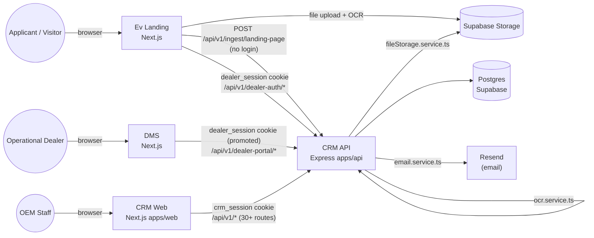
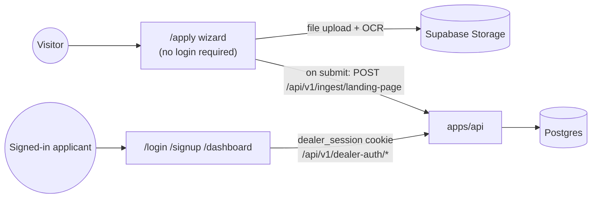
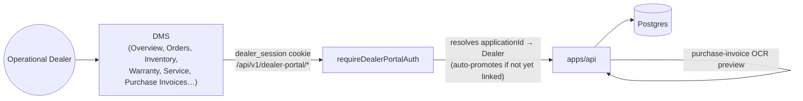
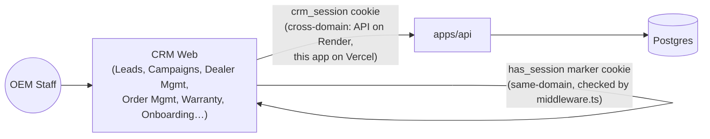
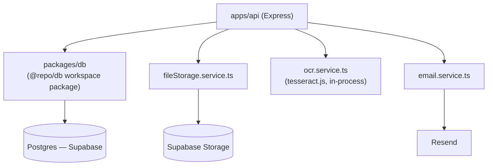

# Cross-App Connections & Dependency Graph

Three separate Next.js frontends — **Ev Landing** (public), **DMS** (dealer portal), and **CRM Web** (`apps/web`, staff) — plus the **CRM API** (`apps/api`, Express) they all talk to. Each frontend lives in its own git repo and deploys independently; none of them share source code and none of them have a database of their own. The API is the only thing that ever touches Postgres, Supabase Storage, or Resend — every frontend reaches those exclusively through it.

## 1. All three sites at a glance

Every arrow into `API` is a plain REST call over HTTPS with a cookie attached — there is no shared code, no shared session store, and no direct database access from any frontend. `packages/db` (the Prisma schema + client) is only ever imported by `apps/api` via the npm workspace package `@repo/db` — it's a **source-code** dependency internal to the `EV-CRM-` monorepo, not something the other two repos can reach at all.

## 2. Ev Landing — individual connection diagram

- **`/apply`** — no login. Documents upload straight to Supabase Storage from this app's own `/api/apply/upload` route (`src/lib/storage/supabaseStorage.ts`), which also runs a plain-text OCR pass (`src/lib/ocr.ts`, tesseract.js) and returns the extracted text alongside the file URL. On final submit, the whole form (plus every uploaded document's URL/OCR text) is POSTed once to the CRM API's public ingest webhook, which creates the `DealerApplication` + `DealerApplicationDocument` rows.
- **`/login`, `/signup`, `/dashboard`** — the self-service onboarding tracker. The browser talks to the CRM API's `/api/v1/dealer-auth/*` endpoints directly (not through this app's own server) using a `dealer_session` cookie signed with `JWT_DEALER_SECRET`. This is the *same* cookie/session mechanism DMS uses (see below) — an applicant who later becomes an operational dealer keeps the same session.
- Never touches Postgres directly, and only touches Supabase Storage for the upload step — everything else is the CRM API.

## 3. DMS — individual connection diagram

- DMS has **no pages that talk to anything except the CRM API** — every list, form, and upload (`crmFetch` in `src/lib/crm/dealerAuth.ts`) goes to `/api/v1/dealer-portal/*`.
- Reuses the exact same `dealer_session` cookie Ev Landing's dealer-auth flow issues. The `requireDealerPortalAuth` middleware resolves that cookie's `applicationId` to an operational `Dealer` row, auto-creating one on first hit if the application hasn't been formally promoted yet — so one login works across both the onboarding tracker (Ev Landing) and the operational portal (DMS) with zero extra setup.
- Purchase-invoice OCR (photograph an invoice, get suggested fields) is proxied entirely through `apps/api` — DMS never talks to Supabase Storage or tesseract.js itself.

## 4. CRM Web (`apps/web`, staff) — individual connection diagram

- Every page under `app/(dashboard)/**` calls `apps/api` via `apiClient` (axios) — no exceptions, no direct DB access.
- Auth is two cookies because the API and this app are on **different domains** in production (API on Render, this app on Vercel): the real `crm_session` (JWT, `JWT_SECRET`) is set by the API and verified server-side on every request; a lightweight `has_session` marker cookie is set on *this app's own domain* by the login form after a successful login, purely so `middleware.ts` can gate routes client-side without being able to read the cross-domain `crm_session` itself.

## 5. The backend hub (`apps/api`) — what it depends on

- **`packages/db`** is the only source-code dependency shared across the monorepo — a Prisma schema + generated client imported as `@repo/db`. It's internal to the `EV-CRM-` repo; DMS and Ev Landing (separate repos) cannot import it and never see a Postgres connection string.
- **`fileStorage.service.ts`** branches at runtime: real Supabase Storage when `SUPABASE_URL`/`SUPABASE_SERVICE_ROLE_KEY` are set, local disk otherwise (dev-only fallback).
- **`ocr.service.ts`** runs fully in-process (tesseract.js) — no external OCR API, no network call.
- **`email.service.ts`** calls Resend only when `RESEND_API_KEY` is set; otherwise it logs and no-ops so nothing ever blocks on a missing key.

## 6. Session/auth mechanisms at a glance

| Cookie | Set by | Verified by | Used by |
|---|---|---|---|
| `crm_session` | `apps/api` (`auth.controller.ts`) | `apps/api`, `JWT_SECRET` | CRM Web (staff) |
| `has_session` | CRM Web's own login form | `apps/web/middleware.ts` (same-domain marker only) | CRM Web (client-side route gating) |
| `dealer_session` | `apps/api` (`dealerAuth.controller.ts`) | `apps/api`, `JWT_DEALER_SECRET` | Ev Landing (`/login`, `/dashboard`) **and** DMS (promoted via `requireDealerPortalAuth`) |
| *(none)* | — | optional HMAC (`INGEST_WEBHOOK_SECRET`) | Ev Landing's `/apply` → ingest webhook (public, no session) |

## 7. Repos and where each one deploys

| Repo | App(s) | Deployed host |
|---|---|---|
| `EV-CRM-` | `apps/api` | `https://ev-crm.onrender.com` |
| `EV-CRM-` | `apps/web` | `https://ev-crm-web.vercel.app` |
| `DMS` | DMS portal | *(check Render/Vercel dashboard — not confirmed here)* |
| `Ev-Landing` | Ev Landing | `https://ev-landing-yjgs.onrender.com` |

All three repos push to GitHub under the same account; each connected hosting service (Render/Vercel) redeploys automatically on push to the tracked branch.
